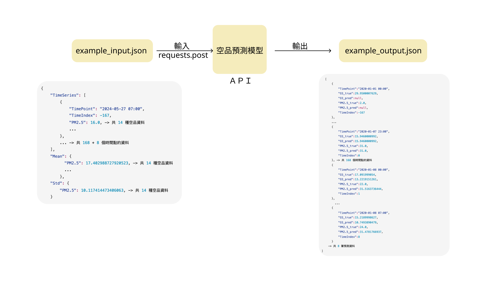
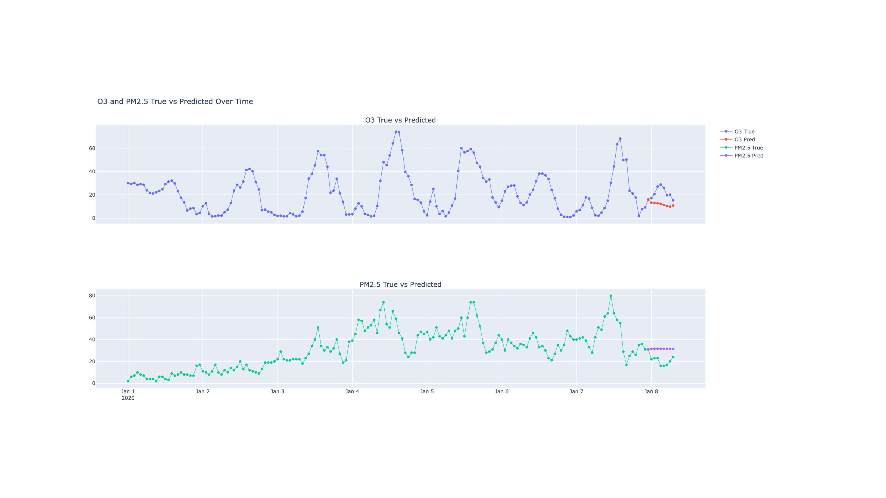

# 空品預測模組資料說明

### 工作項目
- 既仁：
  1. 空品預測系統架構設計：
        1. 設計 `Api` 的輸入與輸出介面 （I/O 介面、資料格式）
        2. 設計 `空品預測模型架構`
  2. 將目前的建模與預測原始碼，轉換成 API 服務。
        1. 將原始 excel 輸入資料轉換成 `json` 格式
        2. 將預測模型放入 API 服務
        3. 將模型的輸出資料轉換成 `json` 格式
- 柏崴：
  1. 提供 `空品預測模型` 的資料輸入
        1. 接收使用者選擇的時間點，將資料送入模型
        2. 從資料庫中讀取資料
        3. 資料清洗，包含缺漏值填補、異常值的處理、資料轉換與與統計值（如標準差、平均值）的計算
        4. 整理成 `json` 格式，並透過 API 送入模型
  2.  將預測結果的 `json` 格式資料，轉換成圖表呈現在網頁上
        1. 網頁操作介面設計再由育蕙提供  

### 空品模型 I/O 介面
- 既仁：
  - 將下圖中的 `空品預測模型`，轉換成 API 服務，將使用者的輸入資料透過 API 送入模型，並將模型的輸出資料透過 API 回傳給使用者。
  - 資料格式參考 `example_input.json`、`example_output.json`。
- 柏崴：
  - 依據使用者選擇預測基準時間（後續說明中 `TimeIndex = 0` 的時間點），從資料庫中讀取後，整理成 `example_input.json` 的格式，並透過 API 送入模型。
  - 接收模型的輸出資料 `example_output.json` 後，繪製成圖表呈現在網頁上。
- **流程示意圖**
  - 

- 頁面結果示意圖：
  - 

### `request.post` 請求格式
- 輸入範例檔 
  `example_input.json`
- 格式如下：
```json
{
    "TimeSeries": [
        {
            "TimePoint": "2024-05-27 07:00",
            "TimeIndex": -167,
            "PM2.5": 16.0, -> 共 14 種空品資料
            ...
        },
        ... -> 共 168 + 8 個時間點的資料
    ],
    "Mean": {
          "PM2.5": 17.402988727920523, -> 共 14 種空品資料
          ...
        },
    "Std": {
        "PM2.5": 10.117414473406063, -> 共 14 種空品資料
    }
```
- `json` 中有三個 key 值：
    - `TimeSeries` : 
      - `TimePoint` 表示資料的時間序列，格式為 `YYYY-MM-DD HH:MM`
      - `TimeIndex` 表示資料的時間序列索引，從 -167 開始，代表當下（使用者選擇的時間點）前 167 小時，0 表示當下，1 表示未來 1 小時，以此類推，共 168 + 8 個時間點的資料，前者表示用來預測的資料共168小時，後者表示預測結果的8小時資料
      - 以下表為例說明：
         | TimePoint        | TimeIndex | 說明       |
         |------------------|-----------|-----------|
         |2024-01-01 00:00  | -167      | 觀測值     |
         |   ...            |  ...      | 觀測值     |
         |2024-01-07 23:00  | 0         | 觀測值(使用者選擇)|
         |2024-01-08 00:00  | 1         | **預測值** |
         |   ...            |  ...      | **預測值** |
         |2024-01-08 07:00  | 8         | **預測值** |

        1. **預測值** 共 8 個時間點，分別為未來 1 小時至未來 8 小時的預測值 
        2. 觀測值(使用者選擇) ：表示使用者選擇要從此時間點開始預測未來 8 小時，如果此時間為當下時間，則之後 8 小時還未發生，因此無法取得資料，各個空品資料的數據填補為 `null`。若使用者選擇的為歷史時間點，之後 8 小時為可取得觀測數據，則直接把對應時間的資料填入。
    
    - `Mean` : 2020/1/1 至前一年的平均值，表示每個空品觀測的平均值。必須先進行 `缺漏值填補`、`異常值的處理`後，再計算平均值。
        >  舉例來說，今天是 2024/7/1，則 `Mean` 的值為 2020/1/1 至 2023/12/31 的平均值。
    - `Std` : `Mean` 對應時間的標準差，表示每個空品觀測的標準差。同樣必須先進行 `缺漏值填補`、`異常值的處理`後，再計算標準差。
 
- `缺漏值填補` 與 `異常值的處理` 邏輯，說明如下：
  - 某日的資料若有缺漏值（null or <0），則以該日`移除異常值後的平均值` 填補。
  - 若某日的資料全部為缺漏值，則以該日`前一日的資料平均值` 填補。
- 14 種空品資料如下：
  - 原空品與天氣資料 共 13 種
    1. `PM2.5` 
    2. `PM10` 
    3. `P` 
    4. `WS` 
    5. `WD` 
    6. `CH4` 
    7. `CO` 
    8. `NMHC` 
    9. `NO` 
    10. `NO2` 
    11. `NOx` 
    12. `O3` 
    13. `SO2` 
  - 其中 `WD` 會轉換為 `cos`、`sin` 兩個特徵
    1.  `WD_cos`
    2.  `WD_sin`
  - 移除 `WD` 後，共 14 種空品資料 
  
### `response 200`  格式
- 輸出範例檔 
  `example_output.json`
- 格式如下：
  ```json
    [
        {
            "TimePoint":"2020-01-01 00:00",
            "O3_true":29.9500007629,
            "O3_pred":null,
            "PM2.5_true":2.0,
            "PM2.5_pred":null,
            "TimeIndex":-167
        },
        ...
        {
            "TimePoint":"2020-01-07 23:00",
            "O3_true":15.9460000992,
            "O3_pred":15.9460000992,
            "PM2.5_true":31.0,
            "PM2.5_pred":31.0,
            "TimeIndex":0
        }, -> 共 168 個時間點的資料
        {
            "TimePoint":"2020-01-08 00:00",
            "O3_true":17.091999054,
            "O3_pred":13.2219151261,
            "PM2.5_true":22.0,
            "PM2.5_pred":31.5163736444,
            "TimeIndex":1
        },
          ...
        {
            "TimePoint":"2020-01-08 07:00",
            "O3_true":15.2189998627,
            "O3_pred":10.7493890479,
            "PM2.5_true":24.0,
            "PM2.5_pred":31.4781766937,
            "TimeIndex":8
        }
      -> 共 8 筆預測資料
  ]
  ```

- `json` 中有六個 key 值：
    - `TimePoint` : 與 input 中的 `TimePoint` 相同
    - `TimeIndex` : 與 input 中的 `TimeIndex` 相同
    - `xxx_true` : xxx表示預測污染物，_true 表示真實值，若 TimeIndex>0 表示預測值，否則表示觀測值
    - `xxx_pred` : xxx表示預測污染物，_pred 表示預測值，TimeIndex<=0 時，所有資料皆為 `null`

### `response 400`  格式
- 有缺漏值 null
- 資料格式錯誤